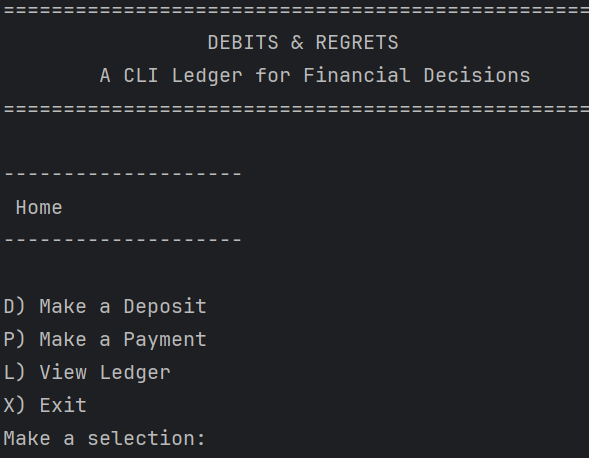
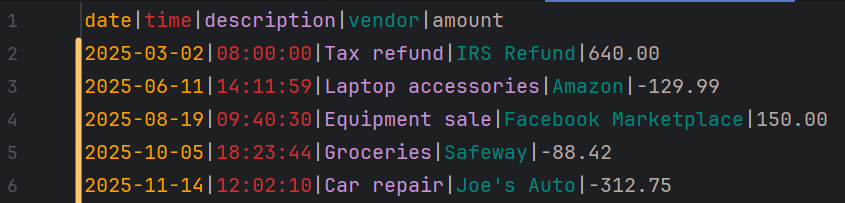
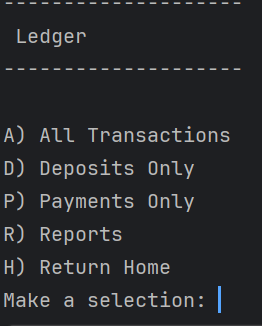
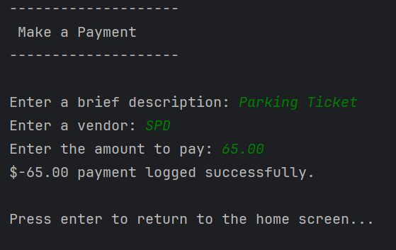
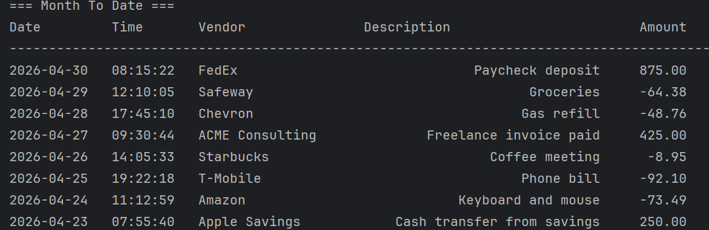
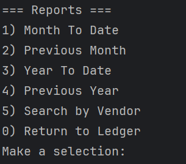

# Accounting Ledger App

## Description
A command-line Java application for tracking deposits and payments and generating reports.

## Features
- Track deposits
- Make payments
- View all transactions
- Filter deposits
- Filter payments
- Run reports
- Search by vendor

## Installation and How to Run
### Prerequisites
- Java Development Kit (JDK) installed
- IntelliJ IDEA or another Java IDE

### Steps
1. Open the project in IntelliJ IDEA.
2. Run the `AccountingLedgerApp` class.

## Usage
- Navigate the home screen to make deposits, payments, or view the ledger.
- Use the ledger screen to filter transactions or generate reports.
- Search for transactions by vendor in the reports section.

## File Format
Transactions are saved in data/transactions.csv using:
date|time|description|vendor|amount

## Future Enhancements
- add more filters types
- add more report types
- add ability to edit transactions
- add ability to delete transactions

## Additional Screenshots

